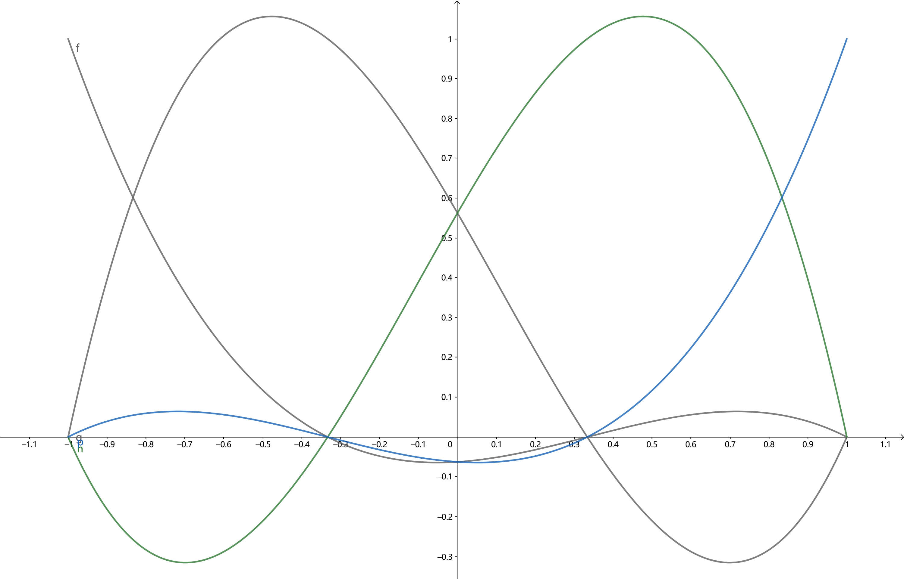

## 一维静态问题

考虑如下的弹性静力学问题的微分方程，强形式为
求 $ u $ 满足
$$(EAu_{,x})_{,x}+fA = 0, \quad in \quad(0, L)$$

即

$$\frac{d}{dx}(EA\frac{du}{dx})+fA = 0, \quad in \quad(0, L)$$
边界条件和力函数如下
(i) $u(0) = g_{1}, u(L) = g_{2}, f = \bar{f}x $ , $ \bar{f} $为常数。

(ii) $u(0) = g_{1}, EAu_{,x}(L) = t, f = \bar{f}x $ , $ \bar{f} $为常数。

其中 $E=10^{11}pa, A = 10^{-4}m^{2}, \bar{f}=10^{11}Nm^{-4}, L=0.1m,g_{1} = 0,g_{2}=0.001m, t = 10^6{N}.$

#### 问题分析
$ \sigma = Eu_{,x} $ 是物理问题的本构关系，也称为本构方程，反映了材料自身的特性，即力与变形之间的关系。问题考虑的是一个长为 $L$ 的杆，杆的横截面接为 $A$.
- 问题 (i): 两端固定(位移边界条件)，在承受外力 $f$ 的情况下，平衡态时杆的位移情况，内力的分布情况。
- 问题 (ii): 左端固定，右端是自由端，在承受在承受外力 $f$ 的情况下，平衡态时杆的位移情况，内力的分布情况。
#### 要求
- 使用 deal.II 有限元 c++ 库.
- 使用线性，二次，三次拉格朗日多项式基函数.
- 计算误差的 $L^2$ 范数，$\sqrt{\int_{\Omega}(u-u^{h})^{2}dx}$.
- 所有的积分使用Gauss求积公式，而不是解析表达式。
- 使用100个单元的网格，画出图像.


#### 弱形式

求 $u\in U$, 使得

$$
\int_{0}^{L} v(EAu_{,x})_{,x}+vfAdx = 0, \forall v\in V
\newline
vEAu_{,x}|_{0}^{L}-\int_{0}^{L}v_{,x}EAu_{,x}dx+\int_{0}^{L}vfAdx = 0, \forall v\in V
$$

其中，试探函数空间和测试函数空间分别为:

- 问题 (i), $v\in V=\{v\in H^{1}(0, L)|v(0)=v(L)=0\}$, 测试函数空间。$u\in U=\{u\in H^1(0, L)|u(0)=g_1,u(L)=g_2\}, 试探函数空间。$

$$
-\int_{0}^{L}v_{,x}EAu_{,x}dx+\int_{0}^{L}vfAdx = 0, 
\newline
\int_{0}^{L}v_{,x}EAu_{,x}dx=\int_{0}^{L}vfAdx.
$$

- 问题 (ii),$v\in V=\{v\in H^{1}(0, L)|v(0)=0\}$, 测试函数空间。$u\in U=\{u\in H^1(0, L)|u(0)=g_1\}, 试探函数空间。$

$$
v(L)EAu_{,x}(L)-\int_{0}^{L}v_{,x}EAu_{,x}dx+\int_{0}^{L}vfAdx = 0, 
\newline
\int_{0}^{L}v_{,x}EAu_{,x}dx=\int_{0}^{L}vfAdx+v(L)EAu_{,x}(L).
$$

#### 有限维近似

取 $U^h\subset U$, 是由一组基张成的有限维空间， $V^h\subset V$ , 也由一组基张成。

- 若$U^h\not\subset U$, 则称之为非协调有限元, 原来的称为协调有限元。

- 若$U^h\neq V^h$, 则称之为 Petro-Galerkin, 原来的称为 Ritz-Galerkin.

令$U^h = V^h = \{\phi_i\in [0, L], i = 0, 1, .., N.\}$, 是按全局编号的基函数，其中
$$\phi_0(x)=\begin{cases}\frac{x_1-x}{x_1-x_0}, &\text{if  $x_0\leq x\leq x_1$}, \\ 0, &\text{otherwise}.\end{cases}$$

$$\phi_j(x)=\begin{cases}\frac{x-x_{j-1}}{x_j - x_{j-1}}, &\text{if $x_{j-1}\leq x\leq x_j$},\\ \frac{x_{j+1}-x}{x_{j+1}-x_{j}},&\text{if $x_j\leq x\leq x_{j+1}$}, \\ 0,&\text{otherwise}.\end{cases}$$

$$\phi_{N}(x)=\begin{cases} \frac{x-x_{N-1}}{x_N-x_{N-1}}, &\text{if $x_{N-1}\leq x\leq x_{N}$},\\ 0,&\text{otherwise}.\end{cases}$$

$ u^h = \sum_{i = 0}^{N} u_j\phi_j(x)$, $v^h = \phi_i(x), i = 1, 2, ..., N.$
从而，问题转化为有限维空间上的问题:
- 问题(i): 求 $ u^h $, 满足
$$
\int_{0}^{L}v_{,x}^h EAu_{,x}^h dx=\int_{0}^{L}v^hfAdx, \forall v^h \in V^h.
\newline
\int_{0}^{L}\frac{d\phi_i(x)}{dx}EA\frac{d}{dx}(\sum_{j = 0}^Nu_j\phi_j(x))dx=\int_0^L\phi_i(x)fAdx.
\newline
\sum_e\int_e\frac{d\phi_i(x)}{dx}EA\frac{d}{dx}(\sum_{j = 0}^Nu_j\phi_j(x))dx=\sum_e\int_e\phi_i(x)fAdx.
$$


- 问题(ii):  求 $ u^h $, 满足
$$
\int_{0}^{L}v_{,x}^h EAu_{,x}^h dx=\int_{0}^{L}v^h fAdx+v(L)EAu_{,x}(L).
\newline
\int_{0}^{L}\frac{d\phi_i(x)}{dx}EA\frac{d}{dx}(\sum_{j = 0}^Nu_j\phi_j(x))dx=\int_0^L\phi_i(x)fAdx+\phi_i(L)EAt.
\newline
\sum_e\int_e\frac{d\phi_i(x)}{dx}EA\frac{d}{dx}(\sum_{j = 0}^Nu_j\phi_j(x))dx=\sum_e\int_e\phi_i(x)fAdx+\phi_i(L)EAt.
$$

但在进行程序设计时，上面的写法并不是一个好主意，因为由基函数找单元的工作比较困难，但由单元找基函数的工作却相对比较容易，且由基函数找单元的工作大量重复单元，这引入了额外的代价，不利于程序实现，网格的数据结构更适合由单元找基函数。
你很难将上面的写法与程序联系起来，根本原因在于没有抓住有限单元法的基本元素--单元，所有的工作应该从单元入手，尤其在进行程序设计时，这点显得尤为重要。
假设我们是一只井底之蛙，只能看到一个单元内的情况，引入局部基函数的概念(其实就是一个单元内的基函数)。

- 线性元

- 二次元

- 三次元



### 程序结构
- main1.cc 定义和求解边值问题的源文件.
- FEM1.h 有限元方法的模板头文件.
- writeSolutions.h 用来创建解.
- CMakeLists.txt 生成 makefile 对文件进行编译.

<div class="mermaid">
graph LR;
main1.cc-->网格生成;
main1.cc-->问题设置;
main1.cc-->初始化数据;
main1.cc-->组装刚度矩阵和右端向量;
main1.cc-->求解线性方程组;
main1.cc-->计算误差;
main1.cc-->输出结果;
</div>

``` c++
/*This is a skeleton code file for use with the Finite Element Method for Problems in Physics.
It uses the deal.II FEM library, dealii.org*/

//Include files
#include <stdio.h>
#include <stdlib.h>
#include <iostream>
#include <fstream>

#include "FEM1.h"
#include "writeSolutions.h"

using namespace dealii;

//The main program, using the FEM class
int main (){
  try{
    deallog.depth_console (0);

    //Specify the basis function order: 1, 2, or 3
    unsigned int order = 2;

    //Specify the subproblem: 1 or 2
    unsigned int problem = 2;

    FEM<1> problemObject(order,problem);

    //Define the number of elements as an input to "generate_mesh"
    problemObject.generate_mesh(100); //e.g. a 10 element mesh
    problemObject.setup_system();
    problemObject.assemble_system();
    problemObject.solve();
    std::cout << problemObject.l2norm_of_error() << std::endl;

    //write output file in vtk format for visualization
    problemObject.output_results();

    //write solutions to h5 file
    char tag[21];
    sprintf(tag, "CA1_Order%d_Problem%d",order,problem);
    writeSolutionsToFileCA1(problemObject.D, problemObject.l2norm_of_error(), tag);
  }
  catch (std::exception &exc){
    std::cerr << std::endl << std::endl
        << "----------------------------------------------------"
        << std::endl;
    std::cerr << "Exception on processing: " << std::endl
          << exc.what() << std::endl
          << "Aborting!" << std::endl
          << "----------------------------------------------------"
          << std::endl;

    return 1;
  }
  catch (...){
    std::cerr << std::endl << std::endl
          << "----------------------------------------------------"
          << std::endl;
    std::cerr << "Unknown exception!" << std::endl
          << "Aborting!" << std::endl
          << "----------------------------------------------------"
          << std::endl;
    return 1;
  }

  return 0;
}
```

其中每一步都用到了有限元模板类中的方法，因此有限元模板类的定义才是问题的关键。

``` c++
/*This is a template file for use with 1D finite elements.
  The portions of the code you need to fill in are marked with the comment "//EDIT".

  Do not change the name of any existing functions, but feel free
  to create additional functions, variables, and constants.
  It uses the deal.II FEM library.*/

//Include files
//Data structures and solvers
#include <deal.II/base/quadrature_lib.h>
#include <deal.II/base/function.h>
#include <deal.II/base/logstream.h>
#include <deal.II/base/tensor_function.h>
#include <deal.II/lac/vector.h>
#include <deal.II/lac/full_matrix.h>
#include <deal.II/lac/sparse_matrix.h>
#include <deal.II/lac/sparse_direct.h>
#include <deal.II/numerics/vector_tools.h>
#include <deal.II/numerics/matrix_tools.h>
#include <deal.II/numerics/data_out.h>
//Mesh related classes
#include <deal.II/grid/tria.h>
#include <deal.II/grid/grid_generator.h>
#include <deal.II/grid/tria_accessor.h>
#include <deal.II/grid/tria_iterator.h>
#include <deal.II/grid/tria_boundary_lib.h>
#include <deal.II/grid/grid_tools.h>
#include <deal.II/dofs/dof_handler.h>
#include <deal.II/dofs/dof_accessor.h>
#include <deal.II/dofs/dof_tools.h>
//Finite element implementation classes
#include <deal.II/fe/fe_system.h>
#include <deal.II/fe/fe_values.h>
#include <deal.II/fe/fe_q.h>
//Standard C++ libraries
#include <stdio.h>
#include <stdlib.h>
#include <iostream>
#include <fstream>
#include <math.h>

using namespace dealii;

template <int dim>
class FEM
{
 public:
  //Class functions
  FEM (unsigned int order,unsigned int problem); // Class constructor 
  ~FEM(); //Class destructor

  //Function to find the value of xi at the given node (using deal.II node numbering)
  double xi_at_node(unsigned int dealNode);

  //Define your 1D basis functions and derivatives
  double basis_function(unsigned int node, double xi);
  double basis_gradient(unsigned int node, double xi);

  //Solution steps
  void generate_mesh(unsigned int numberOfElements);
  void define_boundary_conds();
  void setup_system();
  void assemble_system();
  void solve();
  void output_results();

  //Function to calculate the l2 norm of the error in the finite element sol'n vs. the exact solution
  double l2norm_of_error();
  double exact_solution(double x);
  double righthandside(double x);

  //Class objects
  Triangulation<dim>   triangulation; //mesh
  FESystem<dim>        fe;   //FE element
  DoFHandler<dim>      dof_handler;   //Connectivity matrices

  //Gaussian quadrature - These will be defined in setup_system()
  unsigned int        quadRule;    //quadrature rule, i.e. number of quadrature points
  std::vector<double> quad_points; //vector of Gauss quadrature points
  std::vector<double> quad_weight; //vector of the quadrature point weights

  //Data structures
  SparsityPattern       sparsity_pattern; //Sparse matrix pattern
  SparseMatrix<double>  K;                //Global stiffness (sparse) matrix
  Vector<double>        D, F;             //Global vectors - Solution vector (D) and Global force vector (F)
  std::vector<double>   nodeLocation;     //Vector of the x-coordinate of nodes by global dof number
  std::map<unsigned int,double> boundary_values; //Map of dirichlet boundary conditions
  int                   basisFunctionOrder;
  double                prob, L, g1, g2, h, E, Area, f_bar;

  //solution name array
  std::vector<std::string> nodal_solution_names;
  std::vector<DataComponentInterpretation::DataComponentInterpretation> nodal_data_component_interpretation;
};

// Class constructor for a vector field
template <int dim>
FEM<dim>::FEM(unsigned int order,unsigned int problem)
:
fe (FE_Q<dim>(QIterated<1>(QTrapez<1>(),order)), dim), 
  dof_handler (triangulation)
{
  basisFunctionOrder = order;
  if(problem == 1 || problem == 2){
    prob = problem;
  }
  else{
    std::cout << "Error: problem number should be 1 or 2.\n";
    exit(0);
  }

  //Nodal Solution names - this is for writing the output file
  for (unsigned int i=0; i<dim; ++i){
    nodal_solution_names.push_back("u");
    nodal_data_component_interpretation.push_back(DataComponentInterpretation::component_is_part_of_vector);
  }
}

//Class destructor
template <int dim>
FEM<dim>::~FEM(){
  dof_handler.clear();
}

//Find the value of xi at the given node (using deal.II node numbering)
template <int dim>
double FEM<dim>::xi_at_node(unsigned int dealNode){
  double xi;

  if(dealNode == 0){
    xi = -1.;
  }
  else if(dealNode == 1){
    xi = 1.;
  }
  else if(dealNode <= basisFunctionOrder){
    xi = -1. + 2.*(dealNode-1.)/basisFunctionOrder;
  }
  else{
    std::cout << "Error: you input node number "
         << dealNode << " but there are only " 
         << basisFunctionOrder + 1 << " nodes in an element.\n";
    exit(0);
  }

  return xi;
}

//Define basis functions
template <int dim>
double FEM<dim>::basis_function(unsigned int node, double xi){
  /*"basisFunctionOrder" defines the polynomial order of the basis function,
    "node" specifies which node the basis function corresponds to, 
    "xi" is the point (in the bi-unit domain) where the function is being evaluated.
    You need to calculate the value of the specified basis function and order at the given quadrature pt.*/

  double value = 1.; //Store the value of the basis function in this variable

  /*You can use the function "xi_at_node" (defined above) to get the value of xi (in the bi-unit domain)
    at any node in the element - using deal.II's element node numbering pattern.*/
  // if(basisFunctionOrder == 1){
  //   if(node == 0){
  //     value = 0.5*(1 - xi);
  //   }else if(node == 1){
  //     value = 0.5*(1 + xi);
  //   }else{
  //     std::cout << "no such linear node!" << std::endl;
  //   }
  // } else if(basisFunctionOrder == 2){
  // 	if(node == 0){
  // 		value = -0.5*xi*(1.-xi);
  // 	}else if(node == 1){
  // 		value = 0.5*xi*(1.+xi);
  // 	}else if(node == 2){
  // 		value = 1.-xi*xi;
  // 	}else{
  // 		std::cout << "no such quadratric node!" << std::endl;
  // 	}
  // }else if(basisFunctionOrder == 3){
  // 	if(node == 0){
  // 		value = -9.0/16.*(xi+1.0/3)*(xi-1.0/3)*(xi-1.);
  // 	}else if(node == 1){
  // 		value = 9.0/16.*(xi+1)*(xi+1.0/3)*(xi-1.0/3);
  // 	}else if(node == 2){
		// value = 27.0/16.*(xi+1)*(xi-1.0/3)*(xi-1.);
  // 	}else if(node == 3){
  // 		value = -27.0/16.*(xi+1)*(xi+1.0/3)*(xi-1.);
  // 	} else{
  // 		std::cout << "no such cubic node!" << std::endl;
  // 	}
  // } else{
  // 	std::cout << "no such basis function!" << std::endl;
  // }
  // //EDIT
  for(unsigned int i = 0; i < basisFunctionOrder + 1; i++){
  	if(i != node){
  		value *= (xi - xi_at_node(i))/(xi_at_node(node) - xi_at_node(i));
  	}
  }
  return value;
}

//Define basis function gradient
template <int dim>
double FEM<dim>::basis_gradient(unsigned int node, double xi){
  /*"basisFunctionOrder" defines the polynomial order of the basis function,
    "node" specifies which node the basis function corresponds to, 
    "xi" is the point (in the bi-unit domain) where the function is being evaluated.
    You need to calculate the value of the derivative of the specified basis function and order at the given quadrature pt.
    Note that this is the derivative with respect to xi (not x)*/

  double value = 0.; //Store the value of the gradient of the basis function in this variable

  /*You can use the function "xi_at_node" (defined above) to get the value of xi (in the bi-unit domain)
    at any node in the element - using deal.II's element node numbering pattern.*/
  //EDIT
  if(basisFunctionOrder == 1){
    if(node == 0){
      value = -0.5;
    }else if(node == 1){
      value = 0.5;
    }else{
      std::cout << "no such linear node!" << std::endl;
    }
  } else if(basisFunctionOrder == 2){
  	if(node == 0){
  		value = 0.5*(2*xi - 1);
  	}else if(node == 1){
  		value = 0.5*(1 + 2*xi);
  	}else if(node == 2){
  		value = -2.*xi;
  	}else{
  		std::cout << "no such quadratric node!" << std::endl;
  	}
  } else if(basisFunctionOrder == 3){
  	if(node == 0){
  		value = -9.0/16.*(3.0*xi*xi-2.0*xi-1.0/9.);
  	}else if(node == 1){
  		value = 9.0/16.*(3.0*xi*xi+2.0*xi-1.0/9.);
  	}else if(node == 2){
		value = 27.0/16.*(3.0*xi*xi-2.0/3.*xi-1.0);
  	}else if(node == 3){
  		value = -27.0/16.*(3.0*xi*xi+2.0/3.*xi-1.0);
  	} else{
  		std::cout << "no such cubic node!" << std::endl;
  	}
  }else{
  	std::cout << "no such basis function!" << std::endl;
  }

  return value;
}

//Define the problem domain and generate the mesh
template <int dim>
void FEM<dim>::generate_mesh(unsigned int numberOfElements){

  //Define the limits of your domain
  L = 0.1; //EDIT
  double x_min = 0.;
  double x_max = L;

  Point<dim,double> min(x_min),
    max(x_max);
  std::vector<unsigned int> meshDimensions (dim,numberOfElements);
  GridGenerator::subdivided_hyper_rectangle (triangulation, meshDimensions, min, max);
}

//Specify the Dirichlet boundary conditions
template <int dim>
void FEM<dim>::define_boundary_conds(){
  const unsigned int totalNodes = dof_handler.n_dofs(); //Total number of nodes

  //Identify dirichlet boundary nodes and specify their values.
  //This function is called from within "setup_system"

  /*The vector "nodeLocation" gives the x-coordinate in the real domain of each node,
    organized by the global node number.*/

  /*This loops through all nodes in the system and checks to see if they are
    at one of the boundaries. If at a Dirichlet boundary, it stores the node number
    and the applied displacement value in the std::map "boundary_values". Deal.II
    will use this information later to apply Dirichlet boundary conditions.
    Neumann boundary conditions are applied when constructing Flocal in "assembly"*/
  for(unsigned int globalNode=0; globalNode<totalNodes; globalNode++){
    if(nodeLocation[globalNode] == 0){
      boundary_values[globalNode] = g1;
    }
    if(nodeLocation[globalNode] == L){
      if(prob == 1){
          boundary_values[globalNode] = g2;
      }
    }
  }
}

//Setup data structures (sparse matrix, vectors)
template <int dim>
void FEM<dim>::setup_system(){

  //Define constants for problem (Dirichlet boundary values)
  g1 = 0; g2 = 0.001; h = pow(10, 6);//EDIT
  E = pow(10, 11); Area = pow(10, -4); f_bar = pow(10, 11);
  //Let deal.II organize degrees of freedom
  dof_handler.distribute_dofs (fe);

  //Enter the global node x-coordinates into the vector "nodeLocation"
  MappingQ1<dim,dim> mapping;
  std::vector< Point<dim,double> > dof_coords(dof_handler.n_dofs());
  nodeLocation.resize(dof_handler.n_dofs());
  DoFTools::map_dofs_to_support_points<dim,dim>(mapping,dof_handler,dof_coords);
  for(unsigned int i=0; i<dof_coords.size(); i++){
    nodeLocation[i] = dof_coords[i][0];
  }

  //Specify boundary condtions (call the function)
  define_boundary_conds();

  //Define the size of the global matrices and vectors
  sparsity_pattern.reinit (dof_handler.n_dofs(), dof_handler.n_dofs(),
  dof_handler.max_couplings_between_dofs());
  DoFTools::make_sparsity_pattern (dof_handler, sparsity_pattern);
  sparsity_pattern.compress();
  K.reinit (sparsity_pattern);
  F.reinit (dof_handler.n_dofs());
  D.reinit (dof_handler.n_dofs());

  //Define quadrature rule
  /*A quad rule of 2 is included here as an example. You will need to decide
    what quadrature rule is needed for the given problems*/
  // quadRule = 2; //EDIT - Number of quadrature points along one dimension
  // quad_points.resize(quadRule); quad_weight.resize(quadRule);

  // quad_points[0] = -sqrt(1./3.); //EDIT
  // quad_points[1] = sqrt(1./3.); //EDIT

  // quad_weight[0] = 1.; //EDIT
  // quad_weight[1] = 1.; //EDIT
  // quadRule = 3;
  // quad_points.resize(quadRule); quad_weight.resize(quadRule);
  // quad_points[0] = -sqrt(3./5.);
  // quad_points[1] = 0;
  // quad_points[2] = sqrt(3./5.);

  // quad_weight[0] = 5./9.;
  // quad_weight[1] = 8./9.;
  // quad_weight[2] = 5./9.;
  quadRule = 4;
  quad_points.resize(quadRule); quad_weight.resize(quadRule);
  quad_points[0] = -0.8611363116;
  quad_points[1] = -0.3399810436;
  quad_points[2] = 0.3399810436;
  quad_points[3] = 0.8611363116;

  quad_weight[0] = 0.3478548451;
  quad_weight[1] = 0.6521451549;
  quad_weight[2] = 0.6521451549;
  quad_weight[3] = 0.3478548451;
  
  // quadRule = 5;
  // quad_points.resize(quadRule); quad_weight.resize(quadRule);
  // quad_points[0] = -0.9061798459;
  // quad_points[1] = -0.5384693101;
  // quad_points[2] = 0.0;
  // quad_points[3] = 0.5384693101;
  // quad_points[4] = 0.9061798459;

  // quad_weight[0] = 0.2369268851;
  // quad_weight[1] = 0.4786286705;
  // quad_weight[2] = 0.5688888889;
  // quad_weight[3] = 0.4786286705;
  // quad_weight[4] = 0.2369268851;

  // quadRule = 6;
  // quad_points.resize(quadRule); quad_weight.resize(quadRule);
  // quad_points[0] = -0.93246951;
  // quad_points[1] = -0.66120939;
  // quad_points[2] = -0.23861919;
  // quad_points[3] = 0.23861919;
  // quad_points[4] = 0.66120939;
  // quad_points[5] = 0.93246951;

  // quad_weight[0] = 0.17132449;
  // quad_weight[1] = 0.36076157;
  // quad_weight[2] = 0.46791393;
  // quad_weight[3] = 0.46791393;
  // quad_weight[4] = 0.36076157;
  // quad_weight[5] = 0.17132449;
  //Just some notes...
  std::cout << "   Number of active elems:       " << triangulation.n_active_cells() << std::endl;
  std::cout << "   Number of degrees of freedom: " << dof_handler.n_dofs() << std::endl;   
}

//Form elmental vectors and matrices and assemble to the global vector (F) and matrix (K)
template <int dim>
void FEM<dim>::assemble_system(){

  K=0; F=0;

  const unsigned int   dofs_per_elem = fe.dofs_per_cell; //This gives you number of degrees of freedom per element
  FullMatrix<double> Klocal (dofs_per_elem, dofs_per_elem);
  Vector<double> Flocal (dofs_per_elem);
  std::vector<unsigned int> local_dof_indices (dofs_per_elem);
  double    h_e, x, f;
  //loop over elements  
  typename DoFHandler<dim>::active_cell_iterator elem = dof_handler.begin_active(), 
    endc = dof_handler.end();
  for (;elem!=endc; ++elem){

    /*Retrieve the effective "connectivity matrix" for this element
      "local_dof_indices" relates local dofs to global dofs,
      i.e. local_dof_indices[i] gives the global dof number for local dof i.*/
    elem->get_dof_indices (local_dof_indices);

    /*We find the element length by subtracting the x-coordinates of the two end nodes
      of the element. Remember that the vector "nodeLocation" holds the x-coordinates, indexed
      by the global node number. "local_dof_indices" gives us the global node number indexed by
      the element node number.*/
    h_e = nodeLocation[local_dof_indices[1]] - nodeLocation[local_dof_indices[0]];
    // std::cout << h_e <<std::endl;

    //Loop over local DOFs and quadrature points to populate Flocal and Klocal.
    Flocal = 0.;
    for(unsigned int A=0; A<dofs_per_elem; A++){
      for(unsigned int q=0; q<quadRule; q++){
          x = 0;
           //Interpolate the x-coordinates at the nodes to find the x-coordinate at the quad pt.
          for(unsigned int B=0; B<dofs_per_elem; B++){
            x += nodeLocation[local_dof_indices[B]]*basis_function(B,quad_points[q]);
          }
          //EDIT - Define Flocal.
        f = righthandside(x);
        Flocal(A) += 0.5*f*Area*h_e*basis_function(A, quad_points[q])*quad_weight[q];
      }
    }
    //Add nonzero Neumann condition, if applicable
    if(prob == 2){ 
      if(nodeLocation[local_dof_indices[1]] == L){
        //EDIT - Modify Flocal to include the traction on the right boundary.
      Flocal(1) += h;
      }
    }

    //Loop over local DOFs and quadrature points to populate Klocal
    Klocal = 0;
    for(unsigned int A=0; A<dofs_per_elem; A++){
      for(unsigned int B=0; B<dofs_per_elem; B++){
          for(unsigned int q=0; q<quadRule; q++){

             //EDIT - Define Klocal.
          Klocal(A, B) += 2*E*Area/h_e*quad_weight[q]*basis_gradient(A, quad_points[q])*basis_gradient(B, quad_points[q]);
          }
      }
    }

    //Assemble local K and F into global K and F
    //You will need to used local_dof_indices[A]
    for(unsigned int A=0; A<dofs_per_elem; A++){
      F(local_dof_indices[A]) += Flocal(A);
      //EDIT - add component A of Flocal to the correct location in F
      /*Remember, local_dof_indices[A] is the global degree-of-freedom number
    corresponding to element node number A*/
      for(unsigned int B=0; B<dofs_per_elem; B++){
    //EDIT - add component A,B of Klocal to the correct location in K (using local_dof_indices)
    /*Note: K is a sparse matrix, so you need to use the function "add".
      For example, to add the variable C to K[i][j], you would use:
      K.add(i,j,C);*/
        K.add(local_dof_indices[A], local_dof_indices[B], Klocal(A, B));
      }
    }

  }

  //Apply Dirichlet boundary conditions
  /*deal.II applies Dirichlet boundary conditions (using the boundary_values map we
    defined in the function "define_boundary_conds") without resizing K or F*/
  MatrixTools::apply_boundary_values (boundary_values, K, D, F, false);
}

//Solve for D in KD=F
template <int dim>
void FEM<dim>::solve(){

  //Solve for D
  SparseDirectUMFPACK  A;
  A.initialize(K);
  A.vmult (D, F); //D=K^{-1}*F

}

//Output results
template <int dim>
void FEM<dim>::output_results (){

  //Write results to VTK file
  std::ofstream output1("solution.vtk");
  DataOut<dim> data_out;
  data_out.attach_dof_handler(dof_handler);

  //Add nodal DOF data
  data_out.add_data_vector(D, nodal_solution_names, DataOut<dim>::type_dof_data,
  nodal_data_component_interpretation);
  data_out.build_patches();
  data_out.write_vtk(output1);
  output1.close();
}

template <int dim>
double FEM<dim>::l2norm_of_error(){

  double l2norm = 0.;

  //Find the l2 norm of the error between the finite element sol'n and the exact sol'n
  const unsigned int  dofs_per_elem = fe.dofs_per_cell; //This gives you dofs per element
  std::vector<unsigned int> local_dof_indices (dofs_per_elem);
  double u_exact, u_h, x, h_e;

  //loop over elements  
  typename DoFHandler<dim>::active_cell_iterator elem = dof_handler.begin_active (), 
    endc = dof_handler.end();
  for (;elem!=endc; ++elem){

    //Retrieve the effective "connectivity matrix" for this element
    elem->get_dof_indices (local_dof_indices);

    //Find the element length
    h_e = nodeLocation[local_dof_indices[1]] - nodeLocation[local_dof_indices[0]];

    for(unsigned int q=0; q<quadRule; q++){
      x = 0.; u_h = 0.;
      //Find the values of x and u_h (the finite element solution) at the quadrature points
      for(unsigned int B=0; B<dofs_per_elem; B++){
         x += nodeLocation[local_dof_indices[B]]*basis_function(B,quad_points[q]);
          u_h += D[local_dof_indices[B]]*basis_function(B,quad_points[q]);
      }
      //EDIT - Find the l2-norm of the error through numerical integration.
      /*This includes evaluating the exact solution at the quadrature points*/
      u_exact = exact_solution(x);
      l2norm += pow(u_h - u_exact, 2)*quad_weight[q]*h_e/2.;
      // std::cout << u_h - u_exact <<std::endl;
      // std::cout << u_exact << ", " << u_h << ", " << elem << "," << l2norm << std::endl;
    }
  }
  // std::cout << l2norm << std::endl;
  return sqrt(l2norm);
}

template <int dim>
double FEM<dim>::exact_solution(double x){
  double value = 0.0, f = 0.0;
  f = righthandside(x);
  if(prob == 1)
  {
    value = -1.0/(6*E)*f*x*x + (g2 - g1)/L*x + 1.0/(6*E)*f*L*L + g1;
  }else if(prob == 2){
    value = -1.0/(6*E)*f*x*x+1.0/(2*E)*f*L*L + h/(E*Area)*x + g1;
  }else{
    std::cout << "no such exact solution!" << std::endl;
  }
  return value;
}

template <int dim>
double FEM<dim>::righthandside(double x){
  double value = 0.0;
  value = f_bar*x;
  return value;
}
```


``` c++
#ifndef WRITESOLUTIONS_H_
#define WRITESOLUTIONS_H_
#include <hdf5.h>
#include <deal.II/lac/vector.h>
using namespace dealii;

void writeSolutionsToFileCA1(const Vector<double>& U, double l2Norm, std::string solutionTag){
  hid_t file_id, dataset_id, dataspace_id;
  herr_t      status;
  hsize_t dimens_1d;
  std::cout << "writing solution for Coding Assignment 1 to file : " << solutionTag.c_str() << ".h5" << std::endl;

 //create HDF5 file
  std::string solutionFileName(solutionTag); solutionFileName +=  ".h5";
  file_id = H5Fcreate (solutionFileName.c_str(), H5F_ACC_TRUNC, H5P_DEFAULT, H5P_DEFAULT);
  
  //write scalar values to data set
  dimens_1d = 1;
  double scalarValue[1]={l2Norm};
  dataspace_id = H5Screate_simple(1, &dimens_1d, NULL);
  dataset_id = H5Dcreate(file_id, "l2norm", H5T_IEEE_F64LE, dataspace_id, H5P_DEFAULT, H5P_DEFAULT, H5P_DEFAULT);
  status = H5Dwrite(dataset_id, H5T_IEEE_F64LE, H5S_ALL, H5S_ALL, H5P_DEFAULT, scalarValue);  
  status = H5Sclose(dataspace_id);  
  status = H5Dclose(dataset_id);
 
  //write solution vector to data set
  dimens_1d = U.size();
  std::vector<double> solutionVector(U.size());
  for (unsigned int i=0; i<U.size(); i++){
    solutionVector[i]=U(i);
  } 
  dataspace_id = H5Screate_simple(1, &dimens_1d, NULL);
  dataset_id = H5Dcreate(file_id, "U", H5T_IEEE_F64LE, dataspace_id, H5P_DEFAULT, H5P_DEFAULT, H5P_DEFAULT);
  status = H5Dwrite(dataset_id, H5T_IEEE_F64LE, H5S_ALL, H5S_ALL, H5P_DEFAULT, &solutionVector[0]);  
  status = H5Sclose(dataspace_id);  
  status = H5Dclose(dataset_id);

  //close HDF5 file
  status = H5Fclose(file_id);
}

#endif
```

``` makefile
##
#  CMake script
##

# Set the name of the project and target:
SET(TARGET "main1")

# Declare all source files the target consists of:
SET(TARGET_SRC
  ${TARGET}.cc
  # You can specify additional files here!
  )

# Usually, you will not need to modify anything beyond this point...

CMAKE_MINIMUM_REQUIRED(VERSION 2.8.8)

FIND_PACKAGE(deal.II 8.0 QUIET
  HINTS ${deal.II_DIR} ${DEAL_II_DIR} ../ ../../ $ENV{DEAL_II_DIR}
  )
IF(NOT ${deal.II_FOUND})
  MESSAGE(FATAL_ERROR "\n"
    "*** Could not locate deal.II. ***\n\n"
    "You may want to either pass a flag -DDEAL_II_DIR=/path/to/deal.II to cmake\n"
    "or set an environment variable \"DEAL_II_DIR\" that contains this path."
    )
ENDIF()

DEAL_II_INITIALIZE_CACHED_VARIABLES()
PROJECT(${TARGET})
DEAL_II_INVOKE_AUTOPILOT()
```